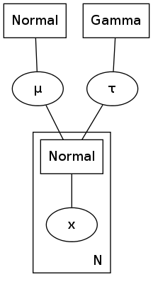
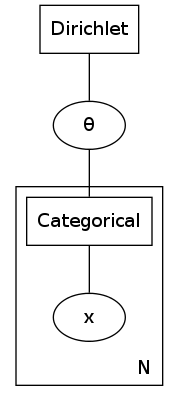
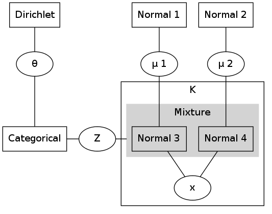
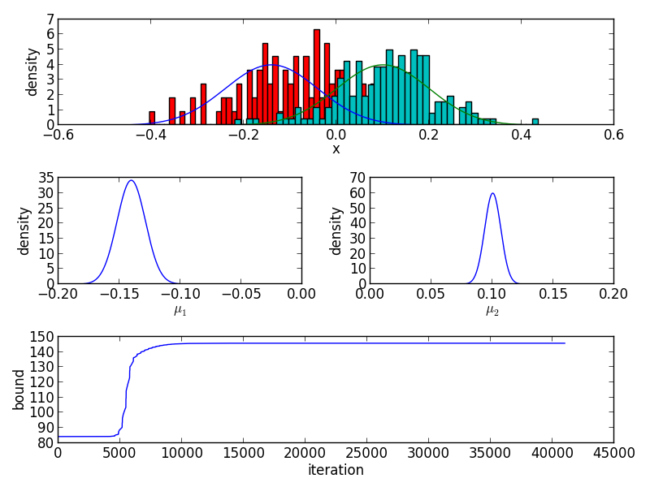

## Factor Graph Library

### Example: Normal distribution with unknown mean and precision

Construct a factor graph with normal distributed observations, a normal prior for the mean and a gamma prior for the precision parameter.

	def construct_fg(data):
	    data = map(lambda x: [x], data)
	    fg  = factor_graph_t()
	    fg += normal_fnode_t("normal1")
	    fg += normal_data_t ("x")
	    fg += normal_fnode_t("normal2", 0, 0.01)
	    fg += normal_vnode_t("mu")
	    fg += gamma_fnode_t ("gamma", 1, 2)
	    fg += gamma_vnode_t ("tau")
	    fg.link("normal1:output",    "x")
	    fg.link("normal2:output",    "mu")
	    fg.link("gamma:output",      "tau")
	    fg.link("normal1:mean",      "mu")
	    fg.link("normal1:precision", "tau")
	    fg.variable_node("x").condition(data)
	    return fg

Generate some data and run the factor graph

	mu    = 1
	sigma = 0.1
	data  = np.random.normal(mu, sigma, 1000)

	fg = construct_fg(data)
	fg()

Instead of having a product normal distribution it is also possible to construct a variable and factor node for each observation.

	def construct_fg(data):
	    data = map(lambda x: [x], data)
	    fg  = factor_graph_t()
	    # factor graph inside the plate
	    fg += normal_fnode_t("normal1")
	    fg += normal_data_t ("x")
	    fg.link("normal1:output", "x")
	    # replicate this graph n-1 times
	    fg.replicate(len(data)-1)
	    # construct graph outside the plate
	    fg += normal_fnode_t("normal2", 0, 0.01)
	    fg += normal_vnode_t("mu")
	    fg += gamma_fnode_t ("gamma", 1, 2)
	    fg += gamma_vnode_t ("tau")
	    fg.link("normal2:output", "mu")
	    fg.link("gamma:output",   "tau")
	    # connect v2 and v3 to all factors f1
	    # within the plate
	    fg.link("normal1:mean",      "mu")
	    fg.link("normal1:precision", "tau")
	    # loop over all variable nodes v1
	    for i, d in enumerate(data):
	        fg.variable_node("x", i).condition([d])
	    return fg

### Example: Categorical distribution with dirichlet prior

	def construct_fg(data):
	    data = map(lambda x: [x], data)
	    fg  = factor_graph_t()
	    fg += categorical_fnode_t("categorical", 3)
	    fg += categorical_data_t ("x", 3)
	    fg += dirichlet_fnode_t  ("dirichlet", [2,1,2])
	    fg += dirichlet_vnode_t  ("theta", 3)
	    fg.link("categorical:output", "x")
	    fg.link("categorical:theta",  "theta")
	    fg.link("dirichlet:output",   "theta")
	    fg.variable_node("x").condition(data)
	    return fg

	data = [0,0,0,1,1,2,1,1,2,0]
	fg = construct_fg(data)
	fg()

### Example: Normal mixture with unknown means

	def construct_fg(data):
	    # prepare the mixture node
	    m   = mixture_fnode_t("mixture")
	    m  += normal_fnode_t("normal1", 0, 100)
	    m  += normal_fnode_t("normal2", 0, 100)
	    # construct graph inside the plate
	    fg  = factor_graph_t()
	    fg += m
	    fg += normal_data_t("x")
	    fg += categorical_fnode_t("categorical", 2)
	    fg += categorical_vnode_t("z", 2)
	    fg.link("mixture:indicator",  "z")
	    fg.link("mixture:output",     "x")
	    fg.link("categorical:output", "z")
	    fg.replicate(len(data)-1)
	    # construct the remaining graph
	    fg += normal_vnode_t("mu1")
	    fg += normal_vnode_t("mu2")
	    fg += normal_fnode_t("normal1", -0.1, 0.01)
	    fg += normal_fnode_t("normal2",  0.1, 0.01)
	    fg += dirichlet_fnode_t("dirichlet", [1,1])
	    fg += dirichlet_vnode_t("theta", 2)
	    fg.link("dirichlet:output",   "theta")
	    fg.link("categorical:theta",  "theta")
	    fg.link("normal1:output", "mu1")
	    fg.link("normal2:output", "mu2")
	    fg.link("mixture:normal1:mean", "mu1")
	    fg.link("mixture:normal2:mean", "mu2")
	    for i, x in enumerate(data):
	        fg.variable_node("x", i).condition([[x]])
	    return fg

### Example: Distributions

Create two normal distributions with different mean and variance. The two distributions are multiplied and the resulting distribution is shown after renormalization.

	n0  = normal_distribution_t()
	n1  = normal_distribution_t(1,2)
	n2  = normal_distribution_t(2,3)
	n0 *= n1
	n0 *= n2
	n0.renormalize()

