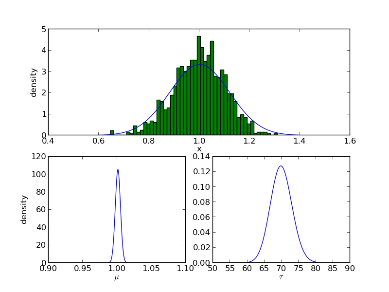
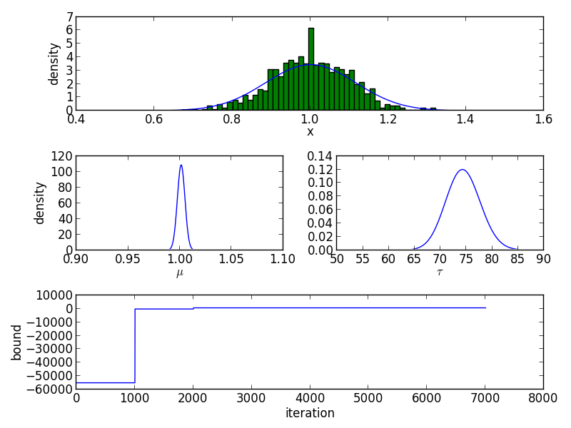

## Factor Graph Library

### Example: Normal data

Construct a factor graph with normal distributed observations, a normal prior for the mean and a gamma prior for the precision parameter.

	def construct_fg1(data):
	    data = map(lambda x: [x], data)
	    fg  = factor_graph_t()
	    fg += normal_fnode_t("f1", 0, 0, len(data))
	    fg += normal_data_t ("v1")
	    fg += normal_fnode_t("f2", 0, 0.01)
	    fg += normal_vnode_t("v2")
	    fg += gamma_fnode_t ("f3", 1, 2)
	    fg += gamma_vnode_t ("v3")
	    fg.link("f1", "output",    "v1")
	    fg.link("f2", "output",    "v2")
	    fg.link("f3", "output",    "v3")
	    fg.link("f1", "mean",      "v2")
	    fg.link("f1", "precision", "v3")
	    fg.variable_node("v1").condition(data)
	    return fg

Generate some data and run the factor graph

	mu    = 1
	sigma = 0.1
	data  = np.random.normal(mu, sigma, 1000)

	fg = construct_fg1(data)
	fg()

Approximated posterior distribution

Instead of having a product normal distribution it is also possible to construct a variable and factor node for each observation.

	def construct_fg0(data):
	    data = map(lambda x: [x], data)
	    fg  = factor_graph_t()
	    # factor graph inside the plate
	    fg += normal_fnode_t("f1", 0, 0)
	    fg += normal_data_t ("v1")
	    fg.link("f1", "output",    "v1")
	    # replicate this graph n-1 times
	    fg.replicate(len(data)-1)
	    # construct graph outside the plate
	    fg += normal_fnode_t("f2", 0, 0.01)
	    fg += normal_vnode_t("v2")
	    fg += gamma_fnode_t ("f3", 1, 2)
	    fg += gamma_vnode_t ("v3")
	    fg.link("f2", "output",    "v2")
	    fg.link("f3", "output",    "v3")
	    # connect v2 and v3 to all factors f1
	    # within the plate
	    fg.link("f1", "mean",      "v2")
	    fg.link("f1", "precision", "v3")
	    # loop over all variable nodes v1
	    for i, d in enumerate(data):
	        fg.variable_node("v1", i).condition([d])
	    return fg

### Example: Distributions

Create two normal distributions with different mean and variance. The two distributions are multiplied and the resulting distribution is shown after renormalization.

	n0  = normal_distribution_t()
	n1  = normal_distribution_t(1,2)
	n2  = normal_distribution_t(2,3)
	n0 *= n1
	n0 *= n2
	n0.renormalize()

