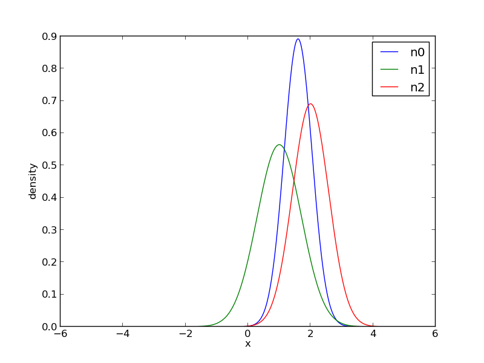

## Factor Graph Library

### Example: Distributions

Create two normal distributions with different mean and variance. The two distributions are multiplied and the resulting distribution is shown after renormalization.

	n0  = normal_distribution_t()
	n1  = normal_distribution_t(1,2)
	n2  = normal_distribution_t(2,3)
	n0 *= n1
	n0 *= n2
	n0.renormalize()

